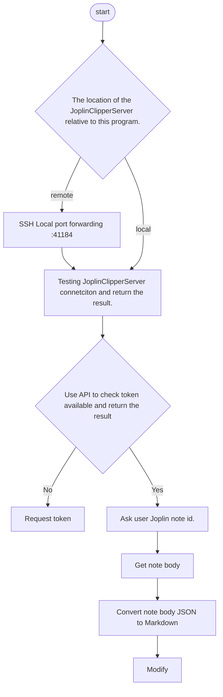

# Joplin2Hexo

## Description
Get the notes and their attachments (including images) via the Joplin API or optionally SSH (SCP) and add the front-matter in hexo format. this script is written in BASH and supports Linux, macOS, Windows (WSL). Implements a one-line command to generate Joplin notes into a Hexo blog.

## Features
- Multi-platform: supports Linux, macOS, Windows (WSL).
- Distributed design: supports Hexo and Joplin not on the same computer.
- Simple & efficient: only 'note id' need to be entered.
- Secure: uses SSH reverse proxy.
- Easy to maintain: uses BASH and Joplin official API.

## Quick Start
### (When you first use) Step1. Clone or download this script to your Hexo root directory.
```
cd $Your_Hexo_Directory
git clone https://github.com/k3nryu/joplin2hexo.git
```
### Step2. Excute following command.
```
joplin2hexo/main.sh
```
Then enter the noteid that you want to upload to Hexo.
> The first time you use it you will be asked to enter your Joplin location. And various information. And generate a profile file. Or you can edit the profile file directly.

# Flowchart
<details>
<summary> Flowchat </summary>



<details>

## Update
```
cd $Your_Hexo_Directory
git pull
```

## Uninstall
```
cd $Your_Hexo_Directory
rm -rf joplin2hexo
```
