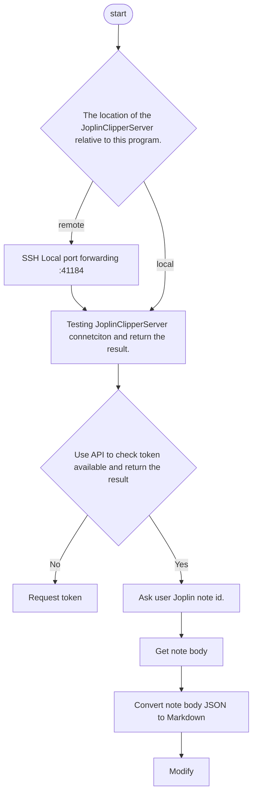

# Joplin2Hexo
[](https://github.com/ellerbrock/open-source-badges/)
[](https://opensource.org/licenses/mit-license.php)
[](https://github.com/ellerbrock/open-source-badges/)

## 说明
本脚本采用BASH编写，支持Linux，macOS，Windows（WSL）。通过Joplin API或者可选SSH(SCP)获取笔记以及其附件（包括图片），并转换为hexo格式。实现一行命令将Joplin笔记生成Hexo博客。

## 特色
- 多平台：支持Linux，macOS，Windows（WSL）
- 分布式设计：支持Hexo和Joplin不在同一台电脑上。
- 简单&高效：只需要输入笔记id。
- 安全：使用SSH反向代理。
- 容易维护：使用BASH和Joplin官方API

## 使用
### Step1.克隆本项目到Hexo博客根目录：
```
git submodule add git@github.com:k3nryu/joplin2hexo.git
```
### Step2.执行下面命令：
```
joplin2hexo/main.sh
```
输入你想要放入Hexo博客的Joplin笔记的ID。
> 第一次使用的时候会让你输入你的Joplin位置。以及各种信息。并生成profile文件。
> 或者你可以直接编辑profile文件。

# 流程图
<details>
<summary>流程图</summary>



</details>

## 更新
```
cd $Your_Hexo_Directory
git pull --recurse-submodules
```

## To-Do
- [ ] 支持embed格式的资源
